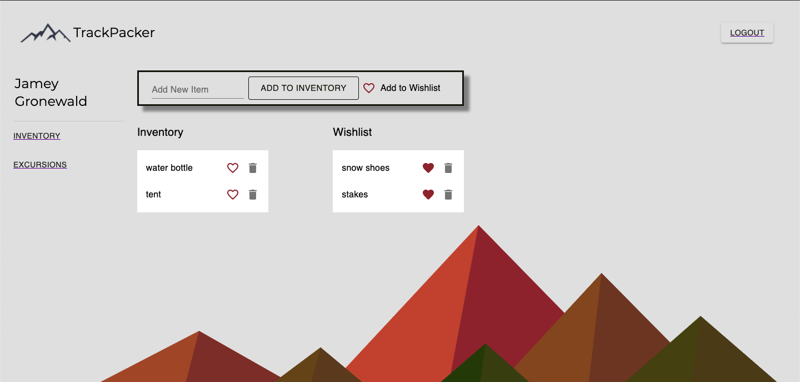

# TrackPacker
MERN application that allows a user to create an “inventory” of all their outdoor gear and plan “excursions” by adding inventory items to a packing list for each excursion

[](https://opensource.org/licenses/MIT)

## Table of Contents
* [Description](#description)
* [Installation](#installation)
* [Usage](#usage)
* [Links](#links)
* [Images](#images)
* [License](#license) 
* [Contributions](#contributions)
* [Questions](#questions)  

## Description
TrackPacker is a MERN application featuring authentication, user-specific data, and a RESTful API allowing the user to create and manipulate data. Users create an inventory and wishlist of adventure gear items, excursions that they plan to undertake, and create packing lists by adding inventory and wishlist items onto any of their excursions. TrackPacker features responsive, user-focused design,leveraging Material UI's component library.

## Installation

* Clone the repo [here](http://www.github.com/jameygronewald/trackPacker) and run  ```npm install```
* Once you have repo cloned and dependencies installed, run  ```npm start``` in the command line to start dev servers on localhost:3000(front-end React UI) and localhost:3001 (back-end Express server).

## Usage

1. Log in or create an account to get started.
2. Add items to your inventory or fill in the "Add to Wishlist" heart to add item to your wishlist.
3. Select the "Excursions" tab on the left to open your excursions view, and create excursions using the input and "SUBMIT" button. You can also choose a detailed view of a particular excursion, or delete it with the "REMOVE" button.
4. In detailed view of an excursion, you will see your inventory on the left (with hearts denoting wishlist items) and can add items into the packing list for your excursion with the "+" button.

## Images


## Links
[GitHub Repo](https://github.com/jameygronewald/trackPacker)

[Deployed](https://trackpacker.herokuapp.com/)

## License

MIT License

Copyright (c) [2020] [Chea Cliatt, Brad Williams, Jamey Gronewald, Justin Ponthier]

Permission is hereby granted, free of charge, to any person obtaining a copy
of this software and associated documentation files (the "Software"), to deal
in the Software without restriction, including without limitation the rights
to use, copy, modify, merge, publish, distribute, sublicense, and/or sell
copies of the Software, and to permit persons to whom the Software is
furnished to do so, subject to the following conditions:

The above copyright notice and this permission notice shall be included in all
copies or substantial portions of the Software.

THE SOFTWARE IS PROVIDED "AS IS", WITHOUT WARRANTY OF ANY KIND, EXPRESS OR
IMPLIED, INCLUDING BUT NOT LIMITED TO THE WARRANTIES OF MERCHANTABILITY,
FITNESS FOR A PARTICULAR PURPOSE AND NONINFRINGEMENT. IN NO EVENT SHALL THE
AUTHORS OR COPYRIGHT HOLDERS BE LIABLE FOR ANY CLAIM, DAMAGES OR OTHER
LIABILITY, WHETHER IN AN ACTION OF CONTRACT, TORT OR OTHERWISE, ARISING FROM,
OUT OF OR IN CONNECTION WITH THE SOFTWARE OR THE USE OR OTHER DEALINGS IN THE
SOFTWARE.

## Contributions
If you wish to contribute to this project, feel welcomed to contact our team.

## Questions
If you have any comments, concerns, or questions about this application, feel free to reach out to any of our contributors.